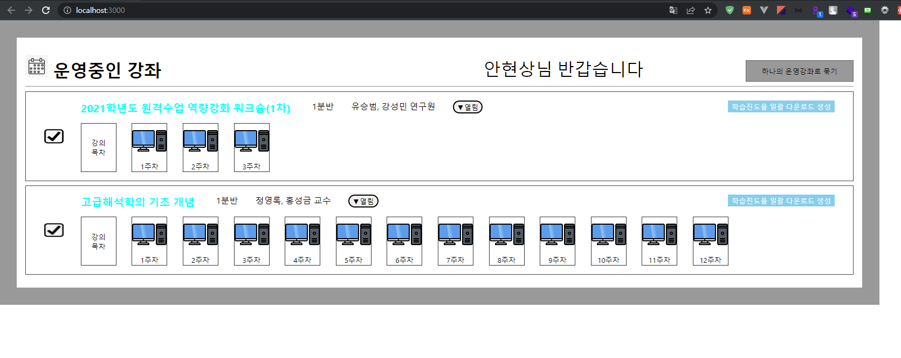

1. 컴포넌트 구성

- App : 주요 시작 지점 (스토어 적용)
- CourseBox : 강좌를 보여주는 메인 box
- CourseList : 각각의 강좌의 상세 정보(이름, 강사, 분반) 등에 대한 내용을 담는 컴포넌트
- WeekBox : 주차별 이미지 + 주차 표기 에 대한 컴포넌트(반복 사용을 위함)

2. react-redux 적용

- 최초 적용은 store를 이용하여 connet와 mapStateToProps를 이용하여 store에 저장된 정적의 state값을 가져오는 방식으로 개발을 진행

- 추후에 useSelector를 이용하여 특정 state의 값을 가져와 사용하는 방식으로 변경
- 모든 데이터는 store에 정적으로 저장되어 있음

  const initialState = {
    courseList: [
    {
    id: 1,
    title: '2021학년도 원격수업 역량강화 워크숍(1차)',
    teacher: '유승범, 강성민 연구원',
    class: '1분반',
    leave_week: 3
    },
    {
    id: 2,
    title: '고급해석학의 기초 개념',
    teacher: '정영록, 홍성금 교수',
    class: '1분반',
    leave_week: 12
    }

    ],
    userName: '안현상'
  }

3. 사용방법

- git clone 이후,
- npm install
- npm start

4. 결과

